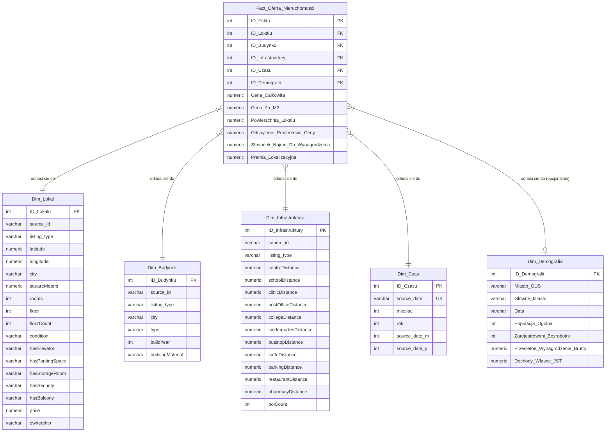

# Szczegółowa Dokumentacja Procesu Ładowania Danych (Load Phase)
## Projekt: RealEstateBusinessIntelligence

Niniejszy dokument przedstawia wyczerpujący i techniczny opis fazy **Load** (ładowania danych) zrealizowanej w skrypcie [spark_load.py](file:///c:/Users/uxbei/Desktop/RealEstateBusinessIntelligence/scripts/dag_scripts/spark_load.py). Proces ten odpowiada za zasilenie docelowego schematu produkcyjnego (schematu gwiazdy `prod.*`) w bazie danych PostgreSQL na podstawie przetworzonych tabel stagingowych (`stg.*`).

---

## 1. Architektura Docelowa: Schemat Gwiazdy (Star Schema)

Baza danych PostgreSQL w schemacie `prod` zorganizowana jest w klasyczną strukturę gwiazdy. Tabela faktów odnosi się do wymiarów za pomocą sztucznych kluczy obcych (Surrogate Keys):



---

## 2. Kolejność Zapisu (FK-safe Order)

Z uwagi na zdefiniowane w bazie danych PostgreSQL powiązania kluczy obcych (Foreign Key Constraints), skrypt Spark realizuje zapis w ściśle określonej kolejności chronologicznej:

1.  **`prod.Dim_Czas`** — klucz główny tej tabeli jest wymagany w tabeli faktów. Nie posiada ona żadnych zależności zewnętrznych.
2.  **`prod.Dim_Lokal`**, **`prod.Dim_Budynek`**, **`prod.Dim_Infrastruktura`**, **`prod.Dim_Demografia`** — wymiary niezależne ładowane równolegle/sekwencyjnie po tabeli czasu.
3.  **`prod.Fact_Oferta_Nieruchomosci`** — tabela faktów jest zapisywana na samym końcu, ponieważ wymaga istnienia wygenerowanych wcześniej kluczy głównych (kluczy sztucznych) we wszystkich wymiarach powiązanych.

---

## 3. Typy Zasilania: Pełne vs Przyrostowe (Incremental)

Proces zasilania jest kontrolowany za pomocą zmiennej środowiskowej `FORCE_FULL_LOAD`:

### 3.1. Pełne Ładowanie (Full Load)
Włącza się, gdy `FORCE_FULL_LOAD=true`.
1.  **Czyszczenie bazy (Truncate)**: Poprzez połączenie JDBC wywoływana jest natywna komenda SQL usuwająca wszystkie dane ze wszystkich tabel w schemacie produkcyjnym z kaskadowym usuwaniem zależności:
    ```sql
    TRUNCATE TABLE prod.Fact_Oferta_Nieruchomosci, prod.Dim_Czas, prod.Dim_Lokal, prod.Dim_Budynek, prod.Dim_Infrastruktura, prod.Dim_Demografia CASCADE;
    ```
2.  **Generowanie SK (Surrogate Keys)**: Klucze sztuczne (ID) są generowane przy użyciu funkcji Spark SQL:
    $$\text{ID} = \text{monotonically\_increasing\_id}() + 1$$
    Gwarantuje to unikalne, rosnące identyfikatory zaczynające się od 1.

### 3.2. Ładowanie Przyrostowe (Incremental Load)
Włącza się domyślnie, gdy `FORCE_FULL_LOAD=false`.
1.  **Odczyt maksymalnego klucza (Max ID query)**: Spark wykonuje zapytanie do PostgreSQL w celu znalezienia aktualnie najwyższego identyfikatora w danej tabeli docelowej:
    ```sql
    SELECT MAX(ID_Tabeli) FROM prod.Dim_Tabela;
    ```
    Wartość ta jest przypisywana do zmiennej `max_id` (w przypadku braku rekordów wynosi 0).
2.  **Przesunięcie identyfikatorów (SK Offset)**: Nowe klucze sztuczne dla dopisywanych wierszy są przesuwane o wartość `max_id`:
    $$\text{Nowe\_ID} = \text{monotonically\_increasing\_id}() + 1 + \text{max\_id}$$
3.  **Unikanie duplikatów (Deduplikacja w locie)**:
    Dla wymiarów posiadających biznesowe klucze unikalne (`Dim_Czas` po `source_date` oraz `Dim_Demografia` po parze `["Miasto_GUS", "Data"]`) stosowany jest mechanizm złączenia wykluczającego typu **left-anti**:
    ```python
    new_df = incoming_df.join(existing_prod_df, on="unique_business_key", how="left_anti")
    ```
    Dzięki temu do bazy dopisywane są wyłącznie nowe rekordy, bez ryzyka naruszenia unikalności kluczy biznesowych.

---

## 4. Szczegółowy Krok po Kroku (Table-by-Table Details)

### 4.1. Ładowanie `prod.Dim_Czas`
*   **Dane wejściowe**: Stagingowa tabela mieszkań (`stg.apartments`).
*   **Procedura**:
    *   Wybiera unikalne wartości z kolumny `source_date`.
    *   Rzutuje je na typ tekstowy `string` oraz parsuje na datę, z której wyciąga `miesiac` (miesiąc liczbowy) oraz `rok`.
    *   W trybie przyrostowym filtruje wiersze za pomocą złączenia `left_anti` z istniejącą tabelą `prod.Dim_Czas` na bazie klucza biznesowego `source_date`.
    *   Generuje unikalny klucz `ID_Czasu`.
    *   Zapisuje nowe wiersze metodą `append` do tabeli docelowej.

### 4.2. Ładowanie `prod.Dim_Lokal`
*   **Dane wejściowe**: Oczyszczona tabela mieszkań (`stg.apartments`).
*   **Procedura**:
    *   Wybiera cechy lokalu i mapuje nazwy kolumn ze stagingu (gdzie są w małych literach po czyszczeniu) na nazwy docelowe w wielkości liter typu CamelCase:
        *   `id` $\rightarrow$ `source_id`
        *   `squaremeters` $\rightarrow$ `squareMeters`
        *   `floorcount` $\rightarrow$ `floorCount`
        *   `hasparkingspace` $\rightarrow$ `hasParkingSpace`
        *   Pozostałe kolumny udogodnień: `hasbalcony` $\rightarrow$ `hasBalcony`, `haselevator` $\rightarrow$ `hasElevator`, `hassecurity` $\rightarrow$ `hasSecurity`, `hasstorageroom` $\rightarrow$ `hasStorageRoom`.
    *   Generuje klucz `ID_Lokalu` (przyrostowo lub od zera).
    *   Zapisuje do bazy danych PostgreSQL.

### 4.3. Ładowanie `prod.Dim_Budynek`
*   **Dane wejściowe**: Oczyszczona tabela mieszkań (`stg.apartments`).
*   **Procedura**:
    *   Wybiera kolumny: `id` (jako `source_id`), `listing_type`, `city`, `type`, `buildyear` (jako `buildYear`), `buildingmaterial` (jako `buildingMaterial`).
    *   Generuje klucz sztuczny `ID_Budynku`.
    *   Zapisuje do `prod.Dim_Budynek`.

### 4.4. Ładowanie `prod.Dim_Infrastruktura`
*   **Dane wejściowe**: Oczyszczona tabela mieszkań (`stg.apartments`).
*   **Procedura**:
    *   Dynamicznie identyfikuje, które kolumny odległości są dostępne w DataFrame (zmienna `available`).
    *   Zmienia nazwy kolumn na CamelCase, np.: `centredistance` $\rightarrow$ `centreDistance`, `schooldistance` $\rightarrow$ `schoolDistance` itd.
    *   Dla kolumn specjalnych liczących odległość do POI (`busstopDistance`, `caffeDistance`, `parkingDistance`), w przypadku ich braku w strukturze stagingowej, generuje wartości `null` rzutowane na `DecimalType(10, 2)`.
    *   Generuje klucz sztuczny `ID_Infrastruktury`.
    *   Usuwa kolumnę `source_date` (która służyła wyłącznie do celów pomocniczych podczas łączenia) i zapisuje wiersze do bazy.

### 4.5. Ładowanie `prod.Dim_Demografia`
*   **Dane wejściowe**: Oczyszczona tabela demografii (`stg.demografia`).
*   **Procedura**:
    *   Wybiera kolumny i zmienia wielkość liter na CamelCase (`miasto_gus` $\rightarrow$ `Miasto_GUS`, `glowne_miasto` $\rightarrow$ `Glowne_Miasto`, `populacja_ogolna` $\rightarrow$ `Populacja_Ogolna` rzutowana na `IntegerType` itp.).
    *   W trybie przyrostowym wykonuje złączenie wykluczające `left_anti` na kluczu kompozytowym `["Miasto_GUS", "Data"]` w celu eliminacji duplikatów.
    *   Generuje klucz sztuczny `ID_Demografii`.
    *   Zapisuje dane do `prod.Dim_Demografia`.

### 4.6. Ładowanie Tabeli Faktów `prod.Fact_Oferta_Nieruchomosci`
Tabela faktów nie jest bezpośrednią kopią żadnej tabeli stagingowej — powstaje poprzez złożone złączenie (Join) tabeli mieszkań ze wszystkimi tabelami wymiarów w celu pobrania ich kluczy sztucznych oraz z tabelą miar:

1.  **Złączenie z wymiarami**:
    *   **`Dim_Lokal`**: `apt.id == Dim_Lokal.source_id AND apt.listing_type == Dim_Lokal.listing_type AND apt.source_date == Dim_Lokal.source_date`.
    *   **`Dim_Budynek`**: `apt.id == Dim_Budynek.source_id AND apt.listing_type == Dim_Budynek.listing_type AND apt.source_date == Dim_Budynek.source_date`.
    *   **`Dim_Infrastruktura`**: `apt.id == Dim_Infrastruktura.source_id AND apt.listing_type == Dim_Infrastruktura.listing_type AND apt.source_date == Dim_Infrastruktura.source_date`.
    *   **`Dim_Czas`**: `apt.source_date == Dim_Czas.source_date`.
    *   **`Dim_Demografia`**: Złączenie odbywa się na podstawie **znormalizowanej nazwy głównego miasta** (`_city_norm`) oraz **roku transakcji** (`_year`), wyciągniętego z daty oferty:
        *   Mieszkanie jest normalizowane za pomocą: `F.translate(F.lower(F.trim(F.col("city"))), "ąćęłńóśźż", "acelnoszz")`
        *   Tabela demografii jest filtrowana pod kątem wyłącznie miast powiatowych (`Miasto_GUS LIKE '%m.%'`), co zapobiega zduplikowaniu rekordów z powiatów ziemskich o tej samej nazwie. Następnie miasto GUS jest mapowane na znormalizowaną postać (`_city_norm`).
        *   Warunek złączenia: `apt_norm._city_norm == demo_norm._city_norm AND apt_norm._year == demo_norm._year` (złączenie typu `left`, ponieważ dane demograficzne dla danej lokalizacji mogą być opcjonalne).
2.  **Złączenie z miarami (`stg.apartments_measures`)**:
    *   Łączy na podstawie klucza kompozytowego: `id`/`listing_type`/`source_date`. Pobiera obliczone wcześniej wartości: `cena_za_m2`, `odchylenie_procentowe_ceny`, `stosunek_najmu_do_wynagrodzenia` i `premia_lokalizacyjna`.
3.  **Rzutowanie miar**:
    *   `price` $\rightarrow$ `Cena_Calkowita` (`DecimalType(15, 2)`)
    *   `cena_za_m2` $\rightarrow$ `Cena_Za_M2` (`DecimalType(10, 2)`)
    *   `squaremeters` $\rightarrow$ `Powierzchnia_Lokalu` (`DecimalType(10, 2)`)
    *   `odchylenie_procentowe_ceny` $\rightarrow$ `Odchylenie_Procentowe_Ceny` (`DecimalType(8, 4)`)
    *   `stosunek_najmu_do_wynagrodzenia` $\rightarrow$ `Stosunek_Najmu_Do_Wynagrodzenia` (`DecimalType(8, 4)`)
    *   `premia_lokalizacyjna` $\rightarrow$ `Premia_Lokalizacyjna` (`DecimalType(10, 2)`)
4.  **Kontrola integralności (Data Integrity Filter)**:
    Aby zapobiec zapisaniu faktów osieroconych (naruszających klucze obce), Spark odrzuca wiersze, które po złączeniach nie dopasowały kluczy sztucznych wymiarów obowiązkowych:
    ```python
    .filter(F.col("ID_Lokalu").isNotNull() & F.col("ID_Budynku").isNotNull() &
            F.col("ID_Infrastruktury").isNotNull() & F.col("ID_Czasu").isNotNull())
    ```
5.  **Zapis**: Zapisywany do bazy danych PostgreSQL tabeli `prod.Fact_Oferta_Nieruchomosci` przy użyciu optymalizacji wsadowej (`reWriteBatchedInserts=true` w URL JDBC oraz `batchsize="20000"` w opcjach zapisu).

---

## 5. Optymalizacje Procesu Ładowania w Spark

W skrypcie ładowania zaimplementowano kluczowe mechanizmy zwiększające wydajność i stabilność połączeń JDBC:
*   **`reWriteBatchedInserts=true`**: Opcja dodana w parametrach URL JDBC PostgreSQL. Zmusza sterownik bazy danych do grupowania zapytań `INSERT` w jedno zapytanie wielowierszowe (batch), co skraca czas zapisu nawet o 80-90%.
*   **`batchsize=20000`**: Definiuje rozmiar pojedynczego pakietu wierszy przesyłanego do bazy w jednym cyklu sieciowym.
*   **Zarządzanie pamięcią podręczną (`cache()` / `unpersist()`)**:
    Tabele stagingowe oraz wygenerowane ramki danych wymiarów (np. `dim_czas`, `dim_lokal` itp.) są buforowane w pamięci podręcznej Sparka (`cache()`), ponieważ są one czytane wielokrotnie (najpierw do zapisu wymiaru, potem do złączeń tabeli faktów). Po zapisaniu tabeli faktów bufor jest jawnie zwalniany (`unpersist()`), zapobiegając wyciekom pamięci executora.
