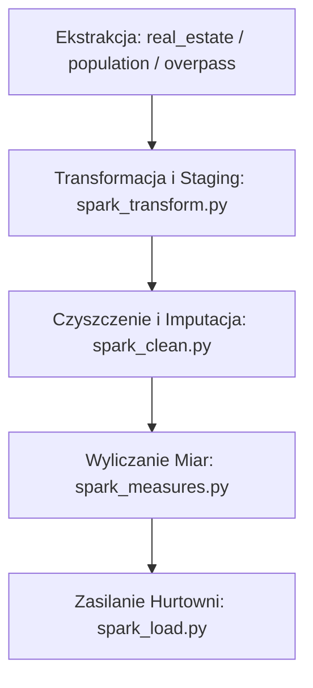

# Szczegółowa Dokumentacja Procesu ETL i Transformacji Danych
## Projekt: RealEstateBusinessIntelligence

Niniejszy dokument przedstawia kompleksowy i szczegółowy opis całego procesu ETL (Extract, Transform, Load) w systemie analizy rynku nieruchomości. Opisuje on każdy krok potoku danych, od pobrania surowych danych ze źródeł zewnętrznych, przez czyszczenie i imputację braków metodami przestrzennymi, wyliczenie miar biznesowych (KPI), aż po zasilenie hurtowni danych w schemacie gwiazdy.

---

## 1. Architektura Ogólna Potoku Danych (ETL Pipeline)

Orkiestracja całego procesu odbywa się przy użyciu **Apache Airflow** (zdefiniowana w [etl_pipeline_dag.py](file:///c:/Users/uxbei/Desktop/RealEstateBusinessIntelligence/dags/etl_pipeline_dag.py)). Potok uruchamia się cyklicznie (co 1 dzień) i składa się z następującej sekwencji kroków:



### Konfiguracja Środowiska Spark
Zadania Sparkowe uruchamiane są w trybie klienckim (`deploy_mode="client"`) z następującymi zasobami:
*   **Liczba rdzeni executora**: 4 (`executor_cores=4`)
*   **Pamięć executora**: 4 GB (`executor_memory="4g"`)
*   **Pamięć drivera**: 1 GB (`driver_memory="1g"`)
*   **Wielkość partycji shuffle**: 4 (`spark.sql.shuffle.partitions=4` w etapie ładowania)

---

## 2. Etap I: Ekstrakcja Danych (Data Extraction)

Ekstrakcja realizowana jest przez zadania typu `PythonOperator` wywołujące funkcję z pliku [fetch_state.py](file:///c:/Users/uxbei/Desktop/RealEstateBusinessIntelligence/dags/fetch_state.py).

### 2.1. Źródła Danych i Pobieranie
System pobiera dane z trzech niezależnych źródeł zewnętrznych:

1.  **Dane o nieruchomościach (Kaggle)**:
    *   **Skrypt**: [get_real_estate_data.py](file:///c:/Users/uxbei/Desktop/RealEstateBusinessIntelligence/scripts/get_real_estate_data.py)
    *   **Zbiór**: `krzysztofjamroz/apartment-prices-in-poland` (pobierany biblioteką `kagglehub`).
    *   **Zasada działania**: Pobiera archiwa CSV. Nazwy plików zawierają datę w formacie `YYYY_MM`. Skrypt wyodrębnia tę datę i zapisuje do nowej kolumny `source_date`.
    *   **Przyrostowość**: Jeśli nie wymuszono pełnego ładowania (`FORCE_FULL_LOAD=false`), skrypt sprawdza w bazie danych (`prod.dim_czas` lub `stg.apartments`) najnowszy załadowany miesiąc i filtruje pliki Kaggle, pobierając wyłącznie nowsze miesiące (parametr `--after YYYY-MM`).
    *   **Wynik**: Pliki `all_apartments_sell.csv` (sprzedaż) oraz `all_apartments_rent.csv` (wynajem) zapisywane w `data/raw/`.

2.  **Dane Demograficzne (GUS BDL API)**:
    *   **Skrypt**: [get_population_data.py](file:///c:/Users/uxbei/Desktop/RealEstateBusinessIntelligence/scripts/get_population_data.py)
    *   **Źródło**: API Banku Danych Lokalnych GUS (`https://bdl.stat.gov.pl/api/v1`).
    *   **Zasada działania**: Pobiera wskaźniki dla 15 głównych miast Polski. Odpytuje o zmienne zdefiniowane w słowniku `ZMIENNE_BI` (np. populacja ogółem, bezrobotni, przeciętne wynagrodzenie, dochody własne JST). Obsługuje mechanizm automatycznego fallbacku ID zmiennych (`FALLBACK_IDS`) w przypadku zmian w API GUS.
    *   **Obsługa limitów (Rate Limiting)**: Używa mechanizmu wykładniczego cofania (exponential back-off) w przypadku kodów HTTP 429 i 503. Opóźnienie między żądaniami wynosi 0.35s (z kluczem API) lub 1.2s (bez klucza).
    *   **Konwersja dat**: Dane roczne/miesięczne z GUS są mapowane na konkretne daty dzienne (np. roczne dane na koniec roku: `YYYY-12-31`, a miesięczne na ostatni dzień danego miesiąca).
    *   **Wynik**: Plik `data/raw/baza_bi_miasta_ROK-OD_ROK-DO.csv`.

3.  **Punkty Użyteczności Publicznej - POI (OpenStreetMap)**:
    *   **Skrypt**: [get_overpass_data.py](file:///c:/Users/uxbei/Desktop/RealEstateBusinessIntelligence/scripts/get_overpass_data.py)
    *   **Źródło**: Overpass API. Odpytuje rotacyjnie 3 niezależne serwery:
        1.  `https://overpass.kumi.systems/api/interpreter`
        2.  `https://overpass-api.de/api/interpreter`
        3.  `https://z.overpass-api.de/api/interpreter`
    *   **Kategorie POI**:
        *   Kawiarnie (`amenity=cafe`)
        *   Parkingi (`amenity=parking`)
        *   Przystanki autobusowe (`highway=bus_stop`)
    *   **Zasada działania**: Pobiera współrzędne geograficzne (szerokość `LAT` i długość `LON`), nazwy oraz adresy (ulica, numer) dla 15 miast. W przypadku błędu 429 czeka 10 sekund i ponawia próbę.
    *   **Wynik**: Trzy pliki CSV: `all_cafes.csv`, `all_parkings.csv`, `all_bus_stops.csv` rozdzielane średnikiem (`;`).

### 2.2. Walidacja Wstępna (Pandas Split Engine)
Przed przekazaniem plików do Sparka, skrypt [fetch_state.py](file:///c:/Users/uxbei/Desktop/RealEstateBusinessIntelligence/dags/fetch_state.py) przeprowadza walidację poprawności wierszy na poziomie biblioteki Pandas:
*   **Weryfikacja obecności wymaganych kolumn**: np. `source_date` dla mieszkań, `Miasto_GUS` dla demografii, `City`/`LAT`/`LON` dla POI.
*   **Kontrola poprawności danych**:
    *   `squareMeters` w przedziale $[10, 300]$,
    *   `price` $> 0$,
    *   `Populacja_Ogolna` $> 0$,
    *   Szerokość i długość geograficzna $\ge 0$.
*   **Znakowanie błędów**: Rekordy niespełniające kryteriów są odrzucane z logowaniem szczegółowego kodu błędu (np. `brak_daty;`, `price_invalid;`, `duplikat;`).

---

## 3. Etap II: Staging i Przygotowanie Danych (`spark_transform.py`)

Skrypt [spark_transform.py](file:///c:/Users/uxbei/Desktop/RealEstateBusinessIntelligence/scripts/dag_scripts/spark_transform.py) pobiera zweryfikowane pliki CSV i przygotowuje je do załadowania do schematu stagingowego (`stg`) w bazie PostgreSQL.

### 3.1. Przyrostowe Filtrowanie Spark
Jeśli zmienna środowiskowa `FORCE_FULL_LOAD` nie ma wartości `true`, skrypt pobiera z bazy danych PostgreSQL maksymalną datę `source_date` (sprawdzając najpierw tabelę produkcyjną `prod.dim_czas`, a w razie jej braku tabelę stagingową `stg.apartments`). Spark odrzuca z przetwarzania wszystkie wiersze, których `source_date` jest mniejsze bądź równe tej dacie.

### 3.2. Normalizacja i Czyszczenie Typów
1.  **Normalizacja miast (`_norm_city`)**: Zmienia litery na małe, usuwa spacje skrajne oraz zamienia polskie znaki diakrytyczne na ich łacińskie odpowiedniki:
    $$\text{Translate: } "ąćęłńóśźż" \rightarrow "acelnoszz"$$
2.  **Rzutowanie typów**:
    *   `squareMeters` castowany na `DecimalType(10, 2)`
    *   `price` castowany na `DecimalType(15, 2)`
    *   Współrzędne geograficzne (`latitude`, `longitude`) zaokrąglane do 6 miejsc po przecinku.
    *   Kolumny odległości (`*Distance`) zaokrąglane do 2 miejsc po przecinku.

### 3.3. Tłumaczenie i Mapowanie Wartości na Język Polski
W celu ujednolicenia prezentacji danych w raportach menedżerskich, wartości tekstowe są mapowane w Spark SQL wg poniższych reguł:

*   **Typ transakcji (`listing_type`)**:
    *   `sell` $\rightarrow$ `Sprzedaż`
    *   `rent` $\rightarrow$ `Wynajem`
*   **Materiał budynku (`buildingMaterial`)**:
    *   `brick` $\rightarrow$ `Cegła`
    *   `concreteSlab` $\rightarrow$ `Wielka płyta`
    *   `null` / puste / "brak informacji" $\rightarrow$ `Brak informacji`
*   **Stan nieruchomości (`condition`)**:
    *   `low` $\rightarrow$ `Do remontu`
    *   `premium` $\rightarrow$ `Wysoki standard`
    *   `null` / puste / "brak informacji" $\rightarrow$ `Brak informacji`
*   **Forma własności (`ownership`)**:
    *   `condominium` $\rightarrow$ `Własność`
    *   `cooperative` $\rightarrow$ `Spółdzielcze własnościowe`
    *   Wartość zawierająca `"udzia"` $\rightarrow$ `Udział w nieruchomości`
    *   `null` / puste / "brak informacji" $\rightarrow$ `Brak informacji`
*   **Typ budynku (`type`)**:
    *   `blockOfFlats` $\rightarrow$ `Blok mieszkalny`
    *   `tenement` $\rightarrow$ `Kamienica`
    *   `apartmentBuilding` $\rightarrow$ `Apartamentowiec`
    *   `null` / puste / "brak informacji" $\rightarrow$ `Brak informacji`
*   **Udogodnienia (`hasParkingSpace`, `hasBalcony`, `hasElevator`, `hasSecurity`, `hasStorageRoom`)**:
    *   `yes` $\rightarrow$ `Tak`
    *   `no` $\rightarrow$ `Nie`
    *   `null` / puste / "brak" / "brak informacji" $\rightarrow$ `Brak informacji`

### 3.4. Obliczanie Odległości do POI (Wzór Haversine)
Dla każdego mieszkania wyliczana jest odległość w kilometrach do najbliższych punktów POI (`cafe`, `parking`, `bus_stop`) znajdujących się w tym samym znormalizowanym mieście (`city_norm`).

Zaimplementowano matematyczny wzór **Haversine**:
$$d = 2R \cdot \arcsin\left(\sqrt{\sin^2\left(\frac{\Delta \phi}{2}\right) + \cos(\phi_1)\cos(\phi_2)\sin^2\left(\frac{\Delta \lambda}{2}\right)}\right)$$
Gdzie:
*   $R = 6371.0 \text{ km}$ (promień Ziemi),
*   $\phi_1, \phi_2$ to szerokości geograficzne punktów w radianach,
*   $\Delta \phi = \phi_2 - \phi_1$,
*   $\Delta \lambda = \lambda_2 - \lambda_1$ (różnica długości geograficznych w radianach).

Następnie dane są grupowane po `(id, listing_type, source_date)` i za pomocą agregacji `F.min()` wyznaczana jest najmniejsza odległość do każdego z trzech typów punktów. Jeśli zbiór POI był pusty (np. brak pliku z przystankami), Spark wykonuje `coalesce` z oryginalnymi wartościami odległości z pliku CSV.

### 3.5. Zapis do Stagingu PostgreSQL (`stg`)
Nazwy kolumn są mapowane na małe litery, a kolumna `source_date` jest rzutowana na typ tekstowy, aby zapobiec problemom z formatowaniem stref czasowych przez sterownik JDBC PostgreSQL. Tabele są zapisywane w trybie `overwrite` ze zleceniem obcięcia tabel (`truncate=true`):
*   `stg.apartments`
*   `stg.demografia`
*   `stg.poi`

---

## 4. Etap III: Czyszczenie Danych i Przestrzenna Imputacja Braków (`spark_clean.py`)

Skrypt [spark_clean.py](file:///c:/Users/uxbei/Desktop/RealEstateBusinessIntelligence/scripts/dag_scripts/spark_clean.py) realizuje zaawansowane czyszczenie danych demograficznych oraz dwufazową imputację brakujących wartości dla nieruchomości przy użyciu algorytmów przestrzennych.

### 4.1. Czyszczenie Danych Demograficznych
*   **Agregacja**: Rekordy są grupowane po `glowne_miasto` i `data`.
*   **Korekta błędów skali GUS**: Zidentyfikowano systematyczny błąd skali w wejściowych danych demograficznych GUS (mężczyźni i kobiety podawani w innych jednostkach niż suma). Skrypt dokonuje korekty:
    $$\text{populacja\_mezczyzni\_skorygowana} = \text{populacja\_mezczyzni} \cdot 10$$
    $$\text{populacja\_kobiety\_skorygowana} = \text{populacja\_kobiety} \cdot 10$$
    $$\text{populacja\_ogolna} = \text{populacja\_mezczyzni\_skorygowana} + \text{populacja\_kobiety\_skorygowana}$$
*   **Filtry**: Odrzucane są rekordy, w których nazwa jednostki GUS nie zawiera oznaczeń miejskich (`%m.%` lub `%st.%`) oraz te o zerowej lub pustej populacji.

### 4.2. Przestrzenna Imputacja Odległości (IDW - Inverse Distance Weighting)
Dla brakujących wartości w 11 kolumnach odległościowych (m.in. `schooldistance`, `centredistance` itp.) zastosowano zoptymalizowaną metodę ważenia odwrotnością odległości (IDW) wewnątrz tego samego miasta, zrealizowaną bezpośrednio w bibliotece Pandas przy użyciu operacji wektorowych w NumPy:
1.  **Grupowanie po miastach**: Proces odbywa się niezależnie dla każdego miasta, co zapobiega powstawaniu wielkich macierzy odległości i redukuje zużycie pamięci.
2.  **Podział na znane i brakujące**: Zbiór punktów w danym mieście dzielony jest na indeksy ze znaną odległością (`known`) oraz te z brakującą wartością (`missing`).
3.  **Podział na pakiety (Batching) i macierz odległości**: Aby zapobiec przeciążeniu pamięci (błąd OOM - kod 137) w przypadku dużych miast (np. Warszawy), proces poszukiwania odległości jest dzielony na pakiety po 1000 brakujących punktów (`batch_size = 1000`). Dla każdego pakietu, wykorzystując mechanizm nadawania kształtów (broadcasting) w NumPy, obliczana jest dwuwymiarowa macierz odległości o bezpiecznym rozmiarze $(1000 \times \text{znane})$:
    $$\text{dists} = \sqrt{(y_{\text{missing\_batch}} - y_{\text{known}})^2 + (x_{\text{missing\_batch}} - x_{\text{known}})^2}$$
4.  **Wybór 10 najbliższych sąsiadów**: Za pomocą szybkiej funkcji `np.argpartition` i następującego po niej sortowania, dla każdego brakującego punktu wybieranych jest do $K = 10$ najbliższych znanych punktów w mieście.
5.  **Ważenie odwrotnością odległości**: Dla wybranych sąsiadów obliczane są wagi $w_i = \frac{1}{\max(\text{dystans}_i, 10^{-9})}$. Zastosowanie małego czynnika $\epsilon = 10^{-9}$ zapobiega błędom dzielenia przez zero i w przypadku odległości zerowej zachowuje się jak dokładne skopiowanie wartości sąsiada.
    $$\hat{y} = \frac{\sum_{i=1}^{10} w_i \cdot y_i}{\sum_{i=1}^{10} w_i}$$
6.  **Fallback**: Jeżeli w danym mieście brak jest jakichkolwiek znanych wartości dla danej cechy (np. wszystkie są puste), system przypisuje medianę z poziomu całego miasta jako fallback.

### 4.3. Przestrzenna Imputacja Cech Budynków (Pandas Spatial Grid Index)
Ze względu na złożoność obliczeniową, imputacja cech budynków (`buildingmaterial`, `condition`, `buildyear`, `type`) oraz udogodnień jest przenoszona do biblioteki Pandas i realizowana przy użyciu zoptymalizowanego indeksu siatki przestrzennej (**Spatial Grid Index**):

```
+-------------------+-------------------+
|  Komórka siatki   |  Komórka siatki   |
|   (c_lat, c_lon)  | (c_lat+1, c_lon)  |
|                   |  [Znaleziony]     |
+-------------------+-------------------+
|  Komórka siatki   |  Punkt szukany    |
| (c_lat, c_lon-1)  |      (lat, lon)   |
+-------------------+-------------------+
```

#### A. Cechy Budynków (`buildingmaterial`, `condition`, `buildyear`, `type`)
*   **Rozmiar oczka siatki**: $0.018$ stopnia geograficznego (około $2 \text{ km}$).
*   **Wyszukiwanie**: Sąsiedzi poszukiwani są w komórce z rekordem oraz w 8 sąsiednich komórkach ($3 \times 3$ komórek wokół punktu) w tym samym mieście.
*   **Faza I (Kopiowanie z bliskiego sąsiedztwa)**: Jeśli najbliższy sąsiad znajduje się w odległości $\le 0.00135$ stopnia (około $150 \text{ m}$), jego wartości są wprost kopiowane do brakujących pól.
*   **Faza II (Głosowanie większościowe)**: Jeśli najbliższy sąsiad jest dalej, wyszukuje się wszystkich sąsiadów w promieniu $\le 0.135$ stopnia (około $15 \text{ km}$). Spośród maksymalnie 20 najbliższych sąsiadów wyznaczana jest wartość dominująca (moda dla cech kategorycznych) lub mediana (dla roku budowy `buildyear`).
*   **Faza III (Fallback)**: Jeśli brak jakichkolwiek sąsiadów w siatce, przypisywana jest dominanta/mediana z poziomu całego miasta (lub domyślny rok 2000).

#### B. Udogodnienia (`hasparkingspace`, `hasbalcony`, `haselevator`, `hassecurity`, `hasstorageroom`)
*   **Rozmiar oczka siatki**: $0.0009$ stopnia geograficznego (około $100 \text{ m}$).
*   **Wyszukiwanie**: Poszukiwanie w promieniu $3 \times 3$ komórek w tym samym mieście.
*   **Zasada imputacji**: Jeśli najbliższy sąsiad znajduje się w promieniu $\le 0.00027$ stopnia (około $30 \text{ m}$), kopiowane są jego udogodnienia (założenie wspólnego bloku mieszkalnego). W przeciwnym wypadku przypisywana jest wartość domyślna `"brak"`.

---

## 5. Etap IV: Obliczanie Miar Biznesowych (`spark_measures.py`)

Zadanie [spark_measures.py](file:///c:/Users/uxbei/Desktop/RealEstateBusinessIntelligence/scripts/dag_scripts/spark_measures.py) pobiera oczyszczone tabele ze stagingu i oblicza wskaźniki efektywności oraz miary analityczne.

### 5.1. Cena za Metr Kwadratowy (`cena_za_m2`)
Obliczana dla każdego rekordu nieruchomości, jeśli powierzchnia jest większa niż 0:
$$\text{cena\_za\_m2} = \frac{\text{price}}{\text{squaremeters}}$$

### 5.2. Deal Index (`odchylenie_procentowe_ceny`)
Określa odchylenie ceny jednostkowej oferty od średniej ceny rynkowej w danej grupie porównawczej (ta sama lokalizacja, typ budynku, liczba pokoi i rodzaj oferty):
1.  Wyliczana jest średnia cena za $m^2$ w grupie:
    $$\mu = \text{Average}(\text{cena\_za\_m2}) \text{ dla podziału: } (\text{city\_norm}, \text{rooms}, \text{type}, \text{listing\_type})$$
2.  Wyliczany jest wskaźnik odchylenia:
    $$\text{odchylenie\_procentowe\_ceny} = \frac{\text{cena\_za\_m2} - \mu}{\mu}$$

### 5.3. KPI 4: Stosunek Najmu do Wynagrodzenia (`stosunek_najmu_do_wynagrodzenia`)
Miara dostępności cenowej mieszkań na wynajem w stosunku do lokalnych zarobków:
$$\text{stosunek\_najmu\_do\_wynagrodzenia} = \frac{\text{cena\_najmu}}{\text{przecietne\_wynagrodzenie\_brutto}}$$
*Obliczane wyłącznie dla ofert typu `Wynajem` w powiązaniu z rokiem oraz znormalizowanym miastem z danych demograficznych GUS.*

### 5.4. KPI 3: Premia Lokalizacyjna (`premia_lokalizacyjna`)
Wskazuje wpływ bogatej infrastruktury na wycenę nieruchomości, wyliczany proporcjonalnie do liczby punktów POI w pobliżu każdego lokalu:
1. Oferty są dzielone na dwie grupy w obrębie każdego miasta (`_city_norm`) i typu oferty (`listing_type` — Sprzedaż vs Wynajem) na podstawie liczby punktów POI w sąsiedztwie:
    * $\text{Grupa Wysoka (POI > 15)}$
    * $\text{Grupa Niska (POI } \le \text{ 15)}$
2. Wyliczana jest średnia "cena" za jeden punkt POI:
    $$\text{cena\_za\_singiel\_POI} = \frac{\bar{x}_{\text{cena\_za\_m2}}(\text{Wysoka}) - \bar{x}_{\text{cena\_za\_m2}}(\text{Niska})}{\bar{x}_{\text{POI}}(\text{Wysoka}) - \bar{x}_{\text{POI}}(\text{Niska})}$$
    W przypadku braku ofert w którejkolwiek z grup lub gdy $\bar{x}_{\text{POI}}(\text{Wysoka}) - \bar{x}_{\text{POI}}(\text{Niska}) \le 0$, wartość `cena_za_singiel_POI` wynosi $0.0$.
3. Premia lokalizacyjna dla konkretnego lokalu wyliczana jest jako:
    $$\text{premia\_lokalizacyjna} = \text{poicount} \cdot \text{cena\_za\_singiel\_POI}$$
    Wartość końcowa jest zaokrąglana do dwóch miejsc po przecinku.

---

## 6. Etap V: Zasilanie Hurtowni Danych - Schemat Gwiazdy (`spark_load.py`)

Skrypt [spark_load.py](file:///c:/Users/uxbei/Desktop/RealEstateBusinessIntelligence/scripts/dag_scripts/spark_load.py) ładuje dane ze stagingu (`stg.*`) do produkcyjnego schematu gwiazdy (`prod.*`).

### 6.1. Zależności i Kolejność Zapisu (FK-safe)
Aby nie naruszyć więzów integralności kluczy obcych (Foreign Keys), zastosowano ścisłą kolejność zapisu tabel:
1.  **`Dim_Czas`** (nie posiada kluczy obcych)
2.  Wymiary niezależne: **`Dim_Lokal`**, **`Dim_Budynek`**, **`Dim_Infrastruktura`**, **`Dim_Demografia`**
3.  Tabela faktów: **`Fact_Oferta_Nieruchomosci`** (zapisywana na samym końcu)

### 6.2. Przyrostowe Generowanie Kluczy Sztucznych (Surrogate Keys)
Klucze główne w wymiarach (np. `ID_Lokalu`, `ID_Budynku`) są generowane przy użyciu funkcji `monotonically_increasing_id()`. 
*   **Wariant pełnego ładowania (`FORCE_FULL_LOAD=true`)**: Następuje wyczyszczenie tabel produkcyjnych za pomocą instrukcji `TRUNCATE ... CASCADE`. Klucze generowane są od zera.
*   **Wariant przyrostowy (`FORCE_FULL_LOAD=false`)**: Z bazy danych pobierana jest maksymalna wartość klucza sztucznego dla danego wymiaru (`max_id`). Następnie nowo dodawane wiersze otrzymują klucze przesunięte o tę wartość:
    $$\text{Klucz Sztuczny} = \text{monotonically\_increasing\_id}() + 1 + \text{max\_id}$$

### 6.3. Tabele Hurtowni Danych

#### A. Wymiar: Dim_Czas
*   **Klucz główny**: `ID_Czasu` (klucz sztuczny)
*   **Biznesowy klucz unikalny**: `source_date` (format `YYYY-MM-DD`)
*   **Atrybuty**: `miesiac`, `rok`, `source_date_m`, `source_date_y`.

#### B. Wymiar: Dim_Lokal
*   **Klucz główny**: `ID_Lokalu`
*   **Atrybuty**: `source_id` (ID z portalu ogłoszeniowego), `listing_type`, `latitude`, `longitude`, `city`, `squareMeters`, `rooms`, `floor`, `floorCount`, `condition`, `hasElevator`, `hasParkingSpace`, `hasStorageRoom`, `hasSecurity`, `hasBalcony`, `price`, `ownership`.

#### C. Wymiar: Dim_Budynek
*   **Klucz główny**: `ID_Budynku`
*   **Atrybuty**: `source_id`, `listing_type`, `city`, `type`, `buildYear`, `buildingMaterial`.

#### D. Wymiar: Dim_Infrastruktura
*   **Klucz główny**: `ID_Infrastruktury`
*   **Atrybuty**: Odległości do poszczególnych obiektów (`centreDistance`, `schoolDistance`, `clinicDistance`, `postOfficeDistance`, `collegeDistance`, `kindergartenDistance`, `busstopDistance`, `caffeDistance`, `parkingDistance`, `restaurantDistance`, `pharmacyDistance`) oraz wskaźnik ogólny `poiCount`.

#### E. Wymiar: Dim_Demografia
*   **Klucz główny**: `ID_Demografii`
*   **Filtrowanie**: Pobiera dane z GUS wyłącznie dla jednostek miejskich (filtrowanie na poziomie `Miasto_GUS` zawierające `%m.%`).
*   **Atrybuty**: `Miasto_GUS`, `Glowne_Miasto`, `Data`, `Populacja_Ogolna`, `Zarejestrowani_Bezrobotni`, `Przecietne_Wynagrodzenie_Brutto`, `Dochody_Wlasne_JST`.

#### F. Tabela Faktów: Fact_Oferta_Nieruchomosci
*   **Klucze obce**: `ID_Lokalu`, `ID_Budynku`, `ID_Infrastruktury`, `ID_Czasu`, `ID_Demografii`.
*   **Klucz główny**: `ID_Faktu` (klucz sztuczny generowany przez bazę danych za pomocą typu `SERIAL`).
*   **Miary**:
    *   `Cena_Calkowita` (cena oferty)
    *   `Cena_Za_M2`
    *   `Powierzchnia_Lokalu`
    *   `Odchylenie_Procentowe_Ceny` (Deal Index)
    *   `Stosunek_Najmu_Do_Wynagrodzenia`
    *   `Premia_Lokalizacyjna`

---

## 7. Narzędzia Pomocnicze (`backup_and_rollback_dag.py`)

Do celów testowych i serwisowych wdrożono dedykowany potok [backup_and_rollback_dag.py](file:///c:/Users/uxbei/Desktop/RealEstateBusinessIntelligence/dags/backup_and_rollback_dag.py):
1.  **Backup**: Przed jakąkolwiek modyfikacją tworzy kompletną kopię zapasową surowych plików CSV w folderze `data/raw/backup/` oznaczając je unikalnym znacznikiem czasu (`YYYYMMDD_HHMMSS`).
2.  **Cofanie zmian (Rollback)**: Odczytuje najnowszy miesiąc w danych wejściowych z kolumny `source_date` i usuwa powiązane wiersze z plików CSV, co pozwala na ponowne zasymulowanie przyrostowego zasilenia dla tego okresu.
